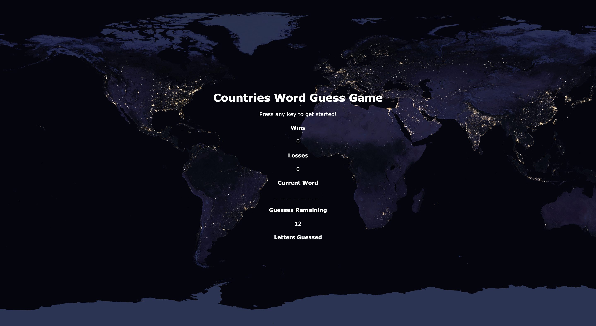

# Word Guess Game

Word Guess Game is a simple version of a hangman style game. The purpose of this assignment was to create a word guess game using Javascript.

### Demo
Word Guess Game is deployed [here](https://nbardoi.github.io/Word-Guess-Game).

### How to Play:

Press any Alpha key (A-Z, a-z) to start game. Non alpha keys are ignored. The theme of the game is 'World Cities'. The game will randomly select a world city form its internal list. It will then display a blank word using underscores to represent the letters in the word. It is possible to have a multi-word city such as Los Angeles.

If a correct letter is guessed, the game will reveal the letter in its correct location. If an incorrect letter is selected, then it will add the letter to a list on incorrectly guessed letters and decrement the remaining guesses count.

If the user guesses the correct city name before remaining guesses equal zero, then the game increments the number of wins and restarts the game by selecting a new random city name and reseting the game parameters.

If the user does not guess the correct city name within the allocated number of guesses, then the game resets. 

### Built With:
 - Javascript
 - HTML
 - CSS
